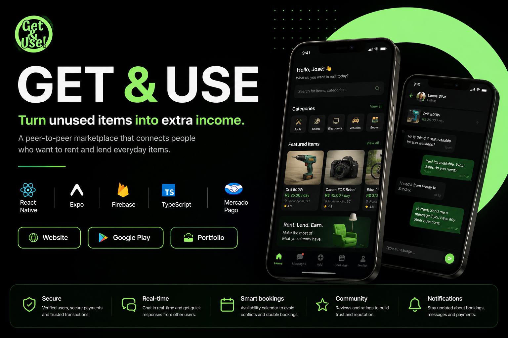

<p align="center">
  
</p>

![React Native] ![TypeScript] ![Firebase] ![Expo] ![Google Play] ![Mercado Pago]

# 📱 Get & Use

### Production-ready cross-platform marketplace built with React Native.

Get & Use is a cross-platform marketplace that allows people to rent, lend and manage everyday items through a secure and intuitive mobile experience.

> Designed, built and deployed from scratch.

🌐 Website: https://geteuse.com.br

📱 Google Play: https://play.google.com/store/apps/details?id=com.getanduseapp

---

# 🎯 The Problem

Millions of items remain unused while other people buy products they need only once.

Get & Use was created to connect people willing to rent and lend everyday items, generating extra income for owners while reducing unnecessary consumption.

---

# 👨‍💻 My Role

I designed and developed the product from the initial idea to production.

As the sole developer and product owner, I was responsible for:

- Product Discovery
- UX/UI Design
- Software Architecture
- Mobile Development
- Backend Development
- Firebase Infrastructure
- Cloud Functions
- Authentication
- Marketplace Business Rules
- Mercado Pago Integration
- Google Play Deployment
- Performance Optimization

---

# 📱 Screenshots

> (Add screenshots here)

Home

Marketplace

Item Details

Reservation Flow

Real-time Chat

Profile

Calendar

Payments

---

# ✨ Main Features

## Marketplace

Browse items available for rent by category and location.

---

## User Profiles

Verified users with ratings and reviews.

---

## Reservation System

Complete reservation flow with availability control.

---

## Real-time Chat

Integrated messaging between renters and owners.

---

## Secure Payments

Mercado Pago integration for online payments.

---

## Reviews

Rate completed rentals and build user reputation.

---

## Push Notifications

Receive updates about reservations and messages.

---

## Cross-platform

Single codebase running on Android, iOS and Web.

---

# 🏗 Architecture

```
Mobile App (React Native)
        │
        ▼
Firebase Authentication
        │
        ▼
Cloud Functions (Backend)
        │
        ▼
Mercado Pago Integration
        │
        ▼
Firebase Cloud Messaging
```

---

## 📊 Project Overview

- 📱 Mobile + Web application
- ⚡ 100+ commits
- 🔥 Firebase backend
- 💳 Mercado Pago integration
- 💬 Real-time chat
- 📦 Cross-platform
- ☁ Cloud-native architecture

# ⚙ Tech Stack

### Frontend

- React Native
- Expo
- TypeScript
- Expo Router
- NativeWind

### Backend

- Firebase Authentication
- Firestore
- Firebase Storage
- Cloud Functions

### Payments

- Mercado Pago

### Tools

- Git
- GitHub
- ESLint
- TypeScript Strict Mode

---

# 🚀 Technical Challenges

## Marketplace Business Rules

Building a reservation flow capable of preventing booking conflicts while keeping the user experience simple.

---

## Payment Flow

Integration with Mercado Pago, including reservation payments, cancellations and refund handling.

---

## Real-time Communication

Real-time messaging system using Firestore listeners, unread counters and push notifications.

---

## Cross-platform Development

Maintaining a single codebase for Android, iOS and Web.

---

## Security

Authentication, Firestore Security Rules and server-side validation using Cloud Functions.

---

# 📈 Why this project stands out

✅ Production-ready architecture

✅ Google Play published

✅ Real-world payment gateway

✅ Cross-platform

✅ Real-time synchronization

✅ Cloud-native backend

✅ Firebase Security Rules

✅ Push Notifications

✅ Offline support

✅ Modular architecture
---

# 📚 What I Learned

Building Get & Use taught me much more than software development.

It required balancing product decisions, technical architecture and business constraints while continuously validating ideas and improving the user experience.

The project reinforced the importance of building software around real user problems instead of simply implementing features.

Building Get & Use strengthened not only my technical skills, but also my ability to make product decisions, prioritize features and continuously improve software based on real-world constraints.

---

# 🔗 Links

[](...)

[](...)

[](...)

---

## ⭐ Building products from real problems.
